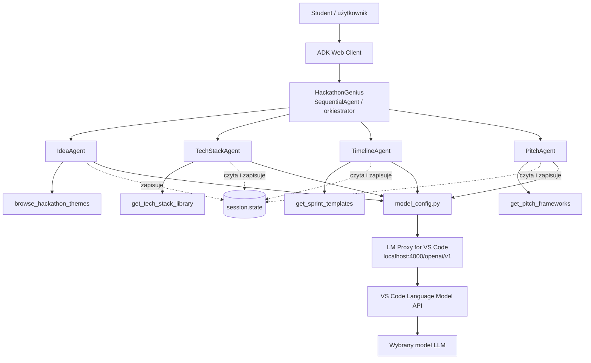

# Hackathon Genius

Polskie demo wieloagentowe zbudowane w Google ADK do pokazania studentom, jak działa orkiestracja agentów, przepływ danych i współpraca z narzędziami.

## O Projekcie

`Hackathon Genius` zamienia krótki temat hackathonu podany przez użytkownika w pełny plan działania:

1. generuje 3 pomysły na projekt,
2. dobiera stack technologiczny,
3. tworzy plan sprintu na hackathon,
4. przygotowuje gotowy pitch na scenę.

Całość jest widoczna krok po kroku w ADK Web, więc dobrze nadaje się do demonstracji orkiestracji agentów na konferencji.

## Prosty Rysunek Architektury

Jeśli Twój podgląd Markdown w VS Code nie renderuje Mermaid, poniżej masz wersję tekstową, która zawsze będzie widoczna poprawnie:

```text
+---------------------+
| Student / użytkownik |
+----------+----------+
           |
           v
+---------------------+
|    ADK Web Client   |
+----------+----------+
           |
           v
+-------------------------------------------+
| HackathonGenius                            |
| SequentialAgent / orkiestrator             |
+----------+-------------+-------------+-----+
           |             |             |
           v             v             v
     +-----------+ +--------------+ +-------------+ +-----------+
     | IdeaAgent | | TechStack    | | Timeline    | | PitchAgent|
     |           | | Agent        | | Agent       | |           |
     +-----+-----+ +------+-------+ +------+------ +-----+-----+
           |              |                |              |
           v              v                v              v
  browse_hackathon_   get_tech_      get_sprint_    get_pitch_
       themes        stack_library     templates     frameworks

           \              |                |              /
            \             |                |             /
             +-----------------------------------------+
             |              session.state              |
             +-----------------------------------------+
                               |
                               v
                    +------------------------+
                    |    model_config.py     |
                    +-----------+------------+
                                |
                                v
             +-------------------------------------------+
             | LM Proxy for VS Code                      |
             | localhost:4000/openai/v1                 |
             +-------------------+-----------------------+
                                 |
                                 v
                    VS Code Language Model API
                                 |
                                 v
                         Wybrany model LLM
```

Wersja Mermaid poniżej zadziała poprawnie wtedy, gdy preview w VS Code ma włączone renderowanie Mermaid.
Jeśli w narzędziu do walidacji lub preview pojawia się komunikat `No diagram type detected matching given configuration for text:`, wklej tylko sam kod diagramu od `flowchart TD` do ostatniej linii, bez tego zdania i bez znaczników ```mermaid.



## Co Warto Pokazać Studentom

1. Użytkownik wpisuje jeden temat, na przykład `AI w edukacji`.
2. Orkiestrator nie robi wszystkiego sam, tylko uruchamia 4 wyspecjalizowane agenty po kolei.
3. Każdy agent ma własną odpowiedzialność i własne narzędzie.
4. Agenty przekazują sobie dane przez `session.state`, a nie przez ręczne kopiowanie tekstu.
5. W ADK Web widać logi, kolejność kroków i wywołania narzędzi.
6. Ten sam model LLM może obsługiwać wiele agentów, ale każdy agent ma inny prompt i inną rolę.

## Role Agentów

| Agent | Rola | Wynik |
|---|---|---|
| `IdeaAgent` | generuje 3 pomysły na projekt | `hackathon_ideas` |
| `TechStackAgent` | dobiera technologie do każdego pomysłu | `tech_stacks` |
| `TimelineAgent` | wybiera najbardziej wykonalny pomysł i układa plan sprintu | `sprint_plan` |
| `PitchAgent` | tworzy końcowy pitch i pytania od jury | `elevator_pitch` |

## Jak Działa Orkiestracja

### 1. Wejście

Student podaje temat hackathonu, na przykład:

`AI dla zdrowia psychicznego studentów`

### 2. Orkiestrator

`HackathonGenius` jest agentem typu `SequentialAgent`, więc uruchamia subagentów w ustalonej kolejności.

### 3. Przepływ danych

Każdy agent:

1. pobiera dane z poprzedniego kroku,
2. wykonuje własne rozumowanie,
3. wywołuje narzędzie,
4. zapisuje wynik do `session.state`.

### 4. Wynik końcowy

Na końcu student dostaje:

1. pomysły na projekty,
2. propozycje technologii,
3. realistyczny plan pracy,
4. gotowy pitch na scenę.

## Co Jest Najciekawsze W Tym Demo

1. To nie jest jeden duży prompt, tylko kilka agentów o różnych specjalizacjach.
2. Widać, jak orkiestrator rozbija problem na etapy.
3. Widać, że narzędzia są wywoływane jawnie i dają dodatkowy kontekst agentom.
4. Można pokazać, że stan sesji działa jak wspólna pamięć robocza.
5. Projekt nadaje się do live demo, bo każdy krok daje czytelny, osobny wynik.

## Sugestia Do Prezentacji Na Scenie

Dobry przebieg demo:

1. pokaż temat wejściowy,
2. uruchom przepływ w ADK Web,
3. zatrzymaj się na logach po każdym agencie,
4. pokaż `session.state` jako wspólny kanał komunikacji,
5. zakończ odczytaniem gotowego pitchu.

## Jednozdaniowe Podsumowanie

`Hackathon Genius` pokazuje studentom, że orkiestracja agentów polega na dzieleniu jednego złożonego zadania na kilka prostszych, wyspecjalizowanych kroków, które współpracują przez wspólny stan i narzędzia.